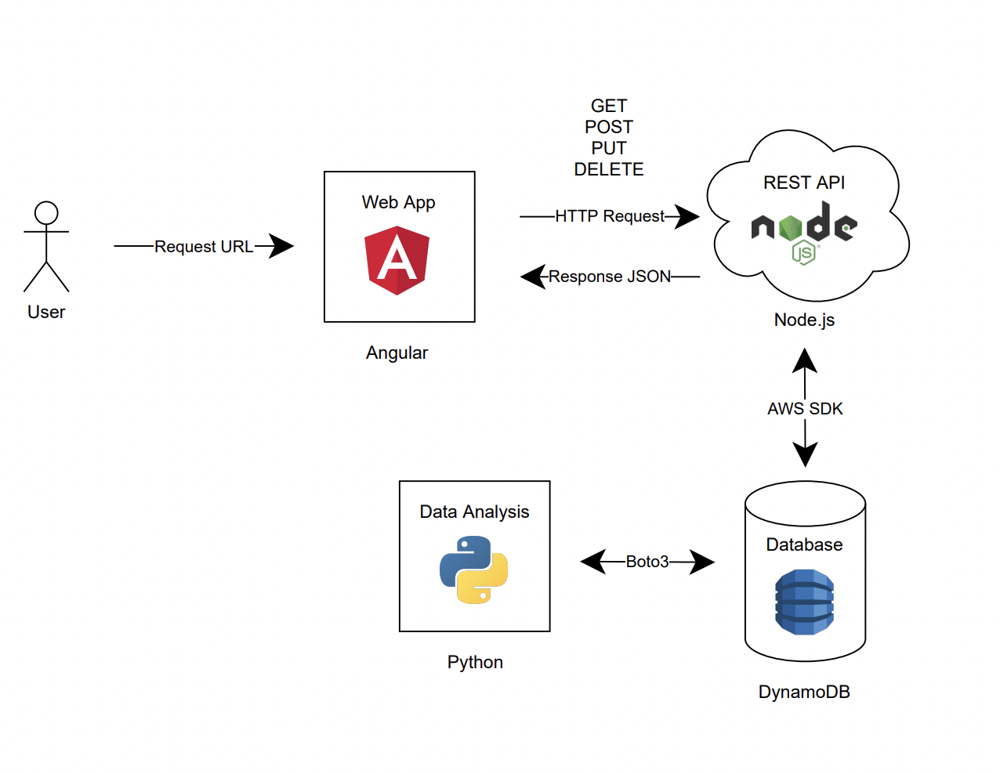

# AdDataBasesProject

Advanced Databases project consisted in creating a Credit App unsing an AWS Infraestructure.

## Folder Structure

- `AdDataBasesProjectREST`: REST API in Node.js
- `AdDataBasesProjectFRONT`: Web App in Vue
- `docs`: Static files
- `Py`: Data Analysis Python Scripts
- `REQs`: Technical Requirements

## Architecture

