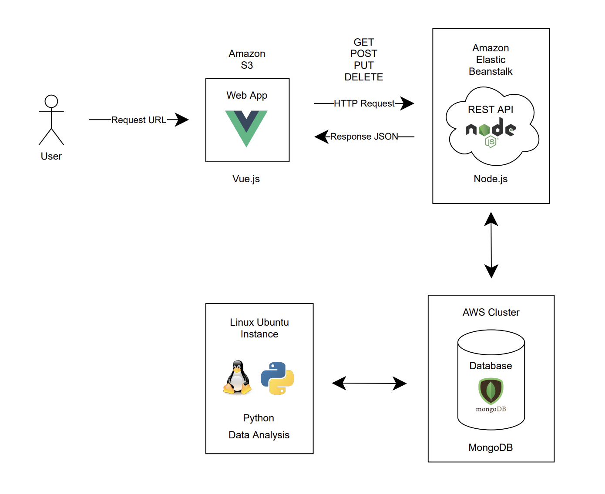

# AdDataBasesProject

Advanced Databases project consisted in creating a solution unsing an AWS Infraestructure and NoSQL Databases.

## Get Loans

This organization began as an idea by 3 Anáhuac Querétaro students: Ivan, Oswaldo and Humberto, about a system that evaluates a client's financial portfolio, for them to authorize credits and evaluate financial stakes.

They saw this as an opportunity to sell this as a service that not only lets you know information about financial stakes, but it also is a loan service for small and medium-sized companies’ clients.

## Folder Structure

- `docs`: Static files
- `get-loans-rest`: REST API in Node.js
- `get-loans`: Web App in Vue.js
- `Py`: Data Analysis Python Scripts
- `REQs`: Technical Requirements

## Architecture

